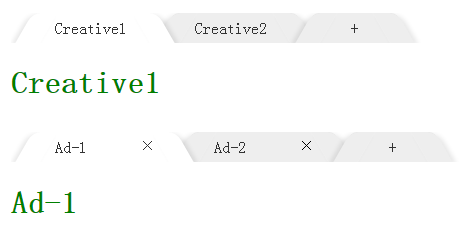

##ko-tab

###简介

knockout的tab组件

###组件截图

#### demo截图



###说明

####引用

参见demo页

####参数

- bActiveNew: 是否自动激活新tab
- fDataHook: 数据挂载函数，在tab下显示的数据，返回一个对象
- fNavTextHook: 导航标题生成函数
- fAfterAddTab: add tab后的钩子
- fAfterRemoveTab: remove tab后的钩子
- fShowAdd: 是否显示+按钮，返回bool值的函数
- fShowRemove: 是否显示×按钮，返回bool值的函数
- fCanRemoveTab: 是否可以删除tab，返回bool值的函数
- fAfterTabActive: tab激活后的钩子
- fSetTabWidth: 动态设置tab导航的宽度，返回数值的函数

详细使用参考demo页和源码

###bulid

```bash
fis3 release -d ./dist
```

###License

MIT
